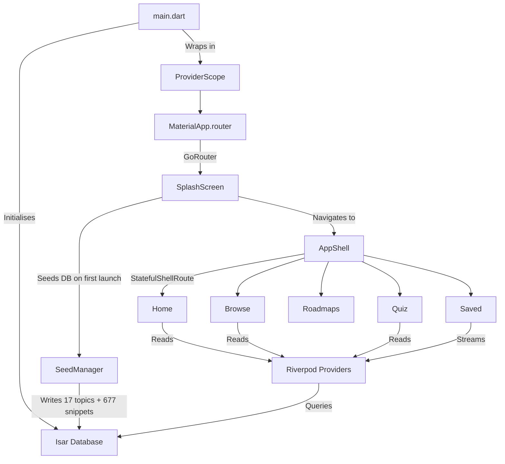

# DevRef — Your Pocket Code Reference 📱💻 

> A fully **offline-first**, beautifully crafted Flutter application housing **677+ code snippets** across **17 programming languages**, interactive quizzes with randomised question generation, curated career roadmaps, and a robust bookmark & search system — all powered by a local NoSQL database with zero network dependencies.

---

## 🌟 Features

| Feature | Description |
|---|---|
| **677+ Code Snippets** | Hand-curated cheat sheets across 17 languages (Kotlin, Python, JavaScript, Java, Dart, C++, Go, Rust, TypeScript, Swift, DSA, Git, Linux, SQL, PHP, C#, Ruby) |
| **Randomised Quiz Engine** | Dynamically generated 10-question quizzes per topic — every session is unique |
| **Career Roadmaps** | 8 detailed career paths (Web Dev, App Dev, Cross-Platform, AI/ML, Data Science, DevOps, Cybersecurity, Backend) with milestones, skills, and time estimates |
| **Offline-First Architecture** | Works with zero internet. All data is pre-seeded into a local Isar NoSQL database on first launch |
| **Full-Text Search** | Search across snippet titles, descriptions, and code content instantly |
| **Bookmark System** | Save and organise favourite snippets with real-time stream-based updates |
| **Recently Viewed** | Automatically tracks and surfaces your last 5 viewed snippets |
| **Difficulty Filtering** | Filter snippets by Very Easy, Medium, Hard, or Very Hard |
| **Day/Night Theme** | Animated toggle switch with persistent theme preference (respects system default) |
| **Animated Splash Screen** | Multi-layered animated splash with gradient orbs, elastic logo, and staggered text reveal |
| **Floating Docking Bar** | macOS-style animated bottom navigation with bounce physics |
| **Syntax Highlighting** | Language-aware code rendering with custom dark/light themes |
| **Share Snippets** | Share code snippets externally via the system share sheet |

---

## 🏗️ Architecture

The application follows a **clean, layered architecture** separating concerns into four distinct layers:

```
lib/
├── core/               ← App-wide configuration
│   ├── router/         ← GoRouter navigation (routes, transitions)
│   └── theme/          ← Material 3 themes, colour tokens, code highlight themes
│
├── data/               ← Data layer (sources, models, seeds)
│   ├── datasources/    ← Isar database singleton + all CRUD operations
│   ├── models/         ← Isar collection schemas (Topic, Snippet)
│   ├── seed/           ← 17 language seed files + SeedManager
│   └── roadmap_data.dart  ← Static roadmap definitions (8 career paths)
│
├── domain/             ← Business logic layer
│   └── providers/      ← Riverpod providers (data, search, theme, saved)
│
├── presentation/       ← UI layer (screens + shared widgets)
│   ├── splash/         ← Animated splash screen
│   ├── home/           ← Dashboard (topics grid, roadmaps, recently viewed)
│   ├── browse/         ← Topic listing + topic detail with difficulty filters
│   ├── quiz/           ← Quiz selection, quiz play, quiz results
│   ├── saved/          ← Bookmarked snippets (grouped by topic)
│   ├── search/         ← Full-text search with topic chip filters
│   ├── roadmap/        ← Roadmap listing + roadmap detail (step-by-step)
│   ├── snippet/        ← Snippet detail (code, description, bookmark, share)
│   ├── shell/          ← App shell with floating docking bar
│   └── shared/         ← Reusable widgets (DockingBar, ToggleSwitch, CodeBlock, etc.)
│
└── main.dart           ← Entry point (Isar init → ProviderScope → MaterialApp.router)
```

### Architectural Flow Diagram



---

## 🧠 How the Random Quiz Generator Works

This is the heart of the app's interactive learning system. Here is the complete flow, with file references:

### Step 1 — User Picks a Topic
**File:** [`quiz_screen.dart`](lib/presentation/quiz/quiz_screen.dart)

The Quiz tab displays all 17 topics in a grid. Each card shows the topic name, icon, and the number of available questions (e.g., "40 questions"). Tapping a card navigates to:
```
/quiz/{topicId}/play
```

### Step 2 — Loading & Shuffling Questions
**File:** [`quiz_play_screen.dart`](lib/presentation/quiz/quiz_play_screen.dart) — `_loadQuestions()` method (line 42)

```dart
Future<void> _loadQuestions() async {
    // 1. Fetch ALL snippets for the chosen topic from Isar
    final snippets = await ref.read(topicSnippetsProvider(widget.topicId).future);

    // 2. Create a Random number generator
    final rng = Random();

    // 3. Shuffle the entire list in-place (Fisher-Yates algorithm)
    final shuffled = List<Snippet>.from(snippets)..shuffle(rng);

    // 4. Take only the first 10 → These become our questions
    _questions = shuffled.take(10).toList();

    // 5. For EACH question, generate 4 multiple-choice options:
    for (var q in _questions) {
        final correct = q.title;  // The correct answer is the snippet's title

        // Pick 3 WRONG answers from OTHER snippets in the same topic
        final others = snippets.where((s) => s.snippetId != q.snippetId).toList()
          ..shuffle(rng);
        final wrongs = others.take(3).map((s) => s.title).toList();

        // Combine and shuffle all 4 options randomly
        final allOptions = [correct, ...wrongs]..shuffle(rng);
        _options.add(allOptions);
        _correctIndices.add(allOptions.indexOf(correct));
    }
}
```

**Key insight:** Each snippet has a `code` block and a `title`. The quiz shows the **code** and asks *"What does this code do?"* — the correct answer is the snippet's `title`, and the 3 wrong answers are titles from other snippets in the same topic. This ensures distractors are contextually plausible (they're all from the same language).

### Step 3 — Question Presentation
The screen rotates through 3 question templates based on the current index:
```dart
static const _questionTemplates = [
    'What does this code do?',
    'What is the output of this code?',
    'What concept does this demonstrate?',
];
```

Each question displays:
- A **progress bar** (current question / total)
- The **difficulty badge** (very_easy, medium, hard, very_hard)
- The actual **code block** with syntax highlighting
- **4 multiple-choice options** — tapping locks the answer
- On answer: **green highlight** for correct, **red** for wrong, plus an **explanation** (the snippet's description)

### Step 4 — Results Screen
**File:** [`quiz_result_screen.dart`](lib/presentation/quiz/quiz_result_screen.dart)

After all 10 questions, the app navigates to `/quiz/{topicId}/result` with the score, total, and full answer breakdown passed as route `extra`. The results screen shows:
- A score circle (green if ≥70%, red otherwise)
- A per-question breakdown (✅ correct / ❌ wrong + correct answer)
- **Retry** button (regenerates a fresh quiz) or **Change Language** button

### Why Every Quiz Session Is Unique
Because the shuffle uses `dart:math Random()` seeded by the system clock, and we shuffle at two levels:
1. **Which 10 snippets** are picked (from a pool of 40 per topic)
2. **The order of the 4 options** within each question

This means even retrying the same topic gives a different quiz every time.

---

### Technical Highlights
- **Clean Architecture:** Fully decoupled architecture using `ISnippetRepository` and `ITopicRepository` to isolate local database logic from the UI.
- **Offline-First:** Seamless functionality without internet, utilizing high-performance Isar NoSQL for instant querying.
- **State Management:** Fully reactive declarative UI built cleanly using Riverpod 2.0+ `Notifier`s and dependency injection.
- **Micro-animations & Shimmers:** Premium enterprise-grade user experience featuring skeleton loading.
- **Multi-threaded Data Parsing:** Optimized JSON-to-database heavy lifting via background Isolates.

## Tech Stack
- **Framework::** Flutter
- **State Management:** Riverpod (`Notifier` & `Provider`)

### Isar NoSQL Database
**File:** [`isar_datasource.dart`](lib/data/datasources/isar_datasource.dart)

The app uses **Isar** — an ultra-fast, zero-latency local NoSQL database for Flutter. It uses a singleton pattern:

```dart
static Isar? _isar;

static Future<Isar> get instance async {
    if (_isar != null && _isar!.isOpen) return _isar!;
    final dir = await getApplicationDocumentsDirectory();
    _isar = await Isar.open([TopicSchema, SnippetSchema], directory: dir.path);
    return _isar!;
}
```

### Data Models

| Model | Fields | File |
|-------|--------|------|
| **Topic** | `topicId`, `name`, `iconPath`, `colorHex`, `snippetCount` | [`topic.dart`](lib/data/models/topic.dart) |
| **Snippet** | `snippetId`, `topicId`, `title`, `description`, `code`, `language`, `difficulty`, `isSaved`, `lastViewedAt` | [`snippet.dart`](lib/data/models/snippet.dart) |

### Seed Architecture
**File:** [`seed_manager.dart`](lib/data/seed/seed_manager.dart)

On the very first launch, the `SeedManager` checks a `SharedPreferences` flag (`seeded_v5`). If not set:
1. Clears existing data (handles version upgrades)
2. Bulk-inserts all 17 `Topic` records in a single Isar write transaction
3. Bulk-inserts all 677+ `Snippet` records in a single write transaction
4. Sets the seed flag to prevent re-seeding

Each language has its own seed file (e.g., `snippets_kotlin.dart`, `snippets_python.dart`) containing 40 snippets distributed across 4 difficulty levels:
- **10 Very Easy** — Basics (Hello World, variables, loops)
- **10 Medium** — Intermediate (generics, patterns, collections)
- **10 Hard** — Advanced (concurrency, metaprogramming)
- **10 Very Hard** — Expert (compiler internals, unsafe code, type theory)

### Why 677+ Snippets Don't Cause Performance Issues

1. **Bulk Transactions:** All snippets are inserted in a single `writeTxn` using `putAll()` — not one-by-one. This keeps the DB write time minimal.
2. **Lazy Rendering:** All list views use `SliverChildBuilderDelegate` / `ListView.builder`, not `ListView(children: [...])`. Only visible items are rendered.
3. **Isar's Zero-Copy Architecture:** Isar maps data directly to memory structures — no JSON parsing, no heavy ORM layer. Reads are near-instantaneous.
4. **Indexed Queries:** `topicId` and `difficulty` are `@Index()` annotated, so filtered queries run in O(log n) time.
5. **Provider Caching:** The `allTopicsProvider` uses `ref.keepAlive()` — the 17 topics are fetched once and cached for the app's lifetime. Other providers auto-dispose when the screen is left.

---

## 🧭 Navigation

**File:** [`app_router.dart`](lib/core/router/app_router.dart)

The app uses **GoRouter** with `StatefulShellRoute.indexedStack` for persistent bottom navigation across 5 tabs:

| Tab | Route | Screen |
|-----|-------|--------|
| Home | `/` | Dashboard with topics, roadmaps, recently viewed |
| Browse | `/browse` | All 17 topics in a grid |
| Quiz | `/quiz` | Quiz topic picker |
| Saved | `/saved` | Bookmarked snippets |
| Roadmaps | `/roadmap` | 8 career roadmaps |

Detail screens use `parentNavigatorKey: _rootNavigatorKey` to render on top of the shell (full-screen), with custom slide transitions:
- `/browse/:topicId` → Topic detail with difficulty filter chips
- `/snippet/:snippetId` → Full snippet view with syntax highlighting
- `/quiz/:topicId/play` → Active quiz session
- `/quiz/:topicId/result` → Quiz results breakdown
- `/roadmap/:id` → Roadmap step-by-step detail
- `/search` → Full-text search overlay

---

## 🎨 Theming

**Files:** [`app_theme.dart`](lib/core/theme/app_theme.dart), [`app_colors.dart`](lib/core/theme/app_colors.dart), [`theme_provider.dart`](lib/domain/providers/theme_provider.dart)

- **Material 3** enabled with curated GitHub-inspired dark/light colour palettes
- **Google Fonts (Inter)** for typography across all text styles
- **Fira Code** for code blocks
- Theme controlled by `ThemeNotifier` (Riverpod `Notifier`) with:
  - Default: follows **system theme** (`ThemeMode.system`)
  - Manual override: user taps the animated sun/moon toggle → persists to `SharedPreferences`
  - On next launch: if a manual override exists, it's restored; otherwise system theme is used

---

## 🛠️ Tech Stack

| Layer | Technology |
|-------|------------|
| **Framework** | Flutter 3.x (Dart 3.8+) |
| **State Management** | Riverpod 2.x (FutureProvider, StreamProvider, Notifier) |
| **Navigation** | GoRouter 14.x with StatefulShellRoute |
| **Local Database** | Isar 3.x (NoSQL, zero-copy, indexed queries) |
| **Theming** | Material 3 + Google Fonts (Inter, Fira Code) |
| **Code Highlighting** | flutter_highlight |
| **Sharing** | share_plus |
| **Persistence** | SharedPreferences (theme, seed flag) |
| **Icons** | SVG language icons via flutter_svg |
| **Build** | Android Gradle Plugin 8.x, Kotlin DSL |

---

## 🚀 Getting Started

### Prerequisites
- Flutter SDK ≥ 3.8.1
- Dart SDK ≥ 3.8.1
- Android SDK 34+

### Setup
```bash
# Clone the repository
git clone https://github.com/aryant/devref.git
cd devref

# Get dependencies
flutter pub get

# Generate Isar schemas (required after model changes)
dart run build_runner build --delete-conflicting-outputs

# Run in debug mode
flutter run

# Build release APK
flutter build apk
```

### Known Build Fix
If you encounter `android:attr/lStar not found` during release builds (caused by `isar_flutter_libs`), the fix is already applied in [`android/build.gradle.kts`](android/build.gradle.kts):
```kotlin
subprojects {
    val subProject = this
    subProject.afterEvaluate {
        pluginManager.withPlugin("com.android.library") {
            configure<LibraryExtension> {
                compileSdk = 34
                compileSdkVersion(34)
            }
        }
    }
}
```

---

## 📁 File Reference

| File | Purpose |
|------|---------|
| `main.dart` | Entry point — Isar init, ProviderScope, MaterialApp.router |
| `isar_datasource.dart` | Database singleton + all CRUD (topics, snippets, search, saved, recent) |
| `snippet.dart` / `topic.dart` | Isar collection schemas |
| `seed_manager.dart` | First-launch seeding orchestrator |
| `snippets_*.dart` (×17) | Language-specific snippet seed data |
| `topic_seeds.dart` | 17 topic definitions with colours and icons |
| `roadmap_data.dart` | 8 career roadmaps with steps, skills, and durations |
| `providers.dart` | All Riverpod data providers |
| `theme_provider.dart` | Theme state management with persistence |
| `app_router.dart` | GoRouter config with all routes and transitions |
| `app_theme.dart` | Material 3 dark/light theme definitions |
| `app_colors.dart` | Colour tokens for both themes |
| `splash_screen.dart` | Animated 3-layer splash screen |
| `home_screen.dart` | Dashboard with topics, roadmaps, recently viewed |
| `quiz_play_screen.dart` | Core quiz engine with random question generation |
| `quiz_result_screen.dart` | Score display and answer breakdown |
| `docking_bar.dart` | Floating animated bottom navigation |
| `toggle_switch.dart` | Animated day/night theme toggle |

---

## 📄 License

This project is proprietary. All rights reserved.
